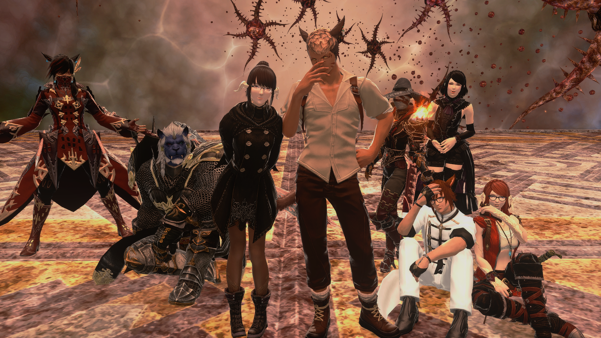
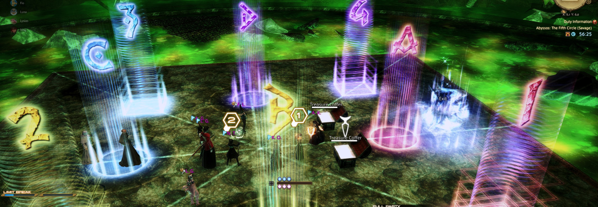

Several members of the Aspects of Love FC stepped into savage this week. Several different groups, and each has a story of success.

<!--more-->

## Hardcore Parkour

We have a few heavy hard core members who are a bit insane. So much so that they spent **11 hours** in P8S on Sunday to get the clear. While that is a bit too steep time wise for myself, I can't help but have a bit of pride for just how crazy they went!

**Massive congratulations to everyone, especially Ray who snagged the mount!**
| Role | Character |
| -- | -- |
| Tanks | Guado Guadian, [Spicy Chicken](https://www.twitch.tv/neekoputkin) (FC Member) |
| DPS | Eilaithium Aeglis, Eleyn Shikimori, Ember Shiranui |
| Healers | Sinon Azura, Ray Vermillion (FC Member), Cyrie Odium |

### Watch their P8S Part 2 Clear



## Just figuring it out

Then you have the group I was in. We started with a few FC members, used Party Finder, and ended the week with a static made of FC members and 3 incredible people from party finder. Tooks a little bit to find our feet, but once we did we cleared P5S Sunday night before enrage hit! That's not too shabby!

**Massive congrats to our new static, aptly called "Inflatable Friends"!**

| Role    | Character                                                                                              |
| ------- | ------------------------------------------------------------------------------------------------------ |
| Tanks   | Kaelyn Orben, Amber Kater                                                                              |
| DPS     | Luna Grant (FC Member), Fio Lefebvre (FC Member), Anha'sae Grant (FC Member), Lysias Grant (FC Member) |
| Healers | [Tirzah Grant](https://www.twitch.tv/lovesudonimh) (FC Member), Niss Tel                               |

## The Party Finder Collective!

One of our FC members, Elyria, got together with a long time BFFs of our FC Tanine and Maxi, and braved party finder their teir for each kill! So far they have made it to P8S part 1 and may even still clear it this week.

### Check out their P7S clear!



The collective responsible for the P7S Clear!
| Role | Character |
| ------- | ---------------------------------------------------------------------------------------------------------------- |
| Tanks | [Tanine Grinnaux](https://www.twitch.tv/tanine_grinnaux) (BFF of FC), Maxi To (BFF of FC) |
| DPS | Rose Fairclough, Nafeiya Lumini'a, [Elyria Oomori](https://www.twitch.tv/elyria_oomori) (FC Member), Lutetia Rae |
| Healers | Yuri Tsukishima, Kimiko Shiraki |

## The Party Finder Calleth

Another of our FC members, Siguard, rocked the PF and has knocked down the carbuncle of dewm in P5S.

## Final thoughts

Good luck to everyone in the upcoming weeks. Now take a break and spend time in your Island Sanctuary!

_If you have something you want to celebrate, get in touch with Tirzah and let her know!_
